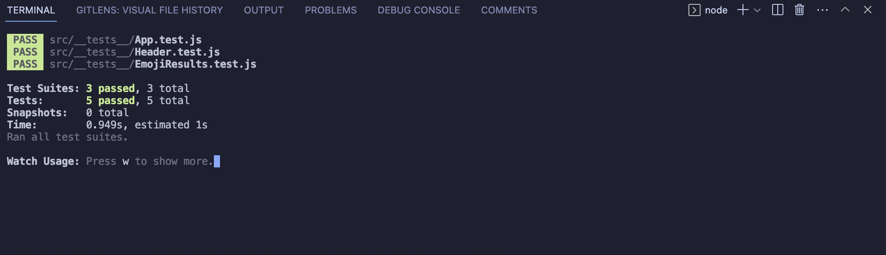

#  Week 3 Homework 3.2

Patika.dev &amp; FMSS Bilişim Front-end Practicum Week3 - Homework 3.2. This is a test project for emoji search project.

## Installation
1. Clone the repository
2. `npm install` command to install dependencies
3. `npm start` command to run the application
4. Open `http://localhost:3000` to view the 
application in the browser.
5. `npm test` command to run the tests

## Assignment Requirements
https://app.patika.dev/courses/react/odev5

## Result

